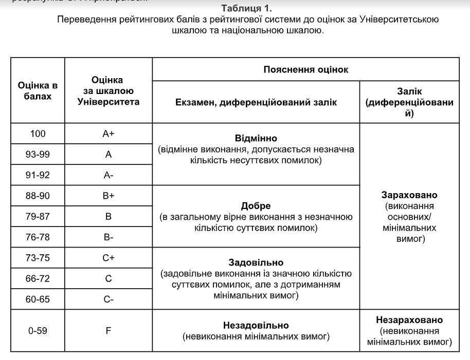
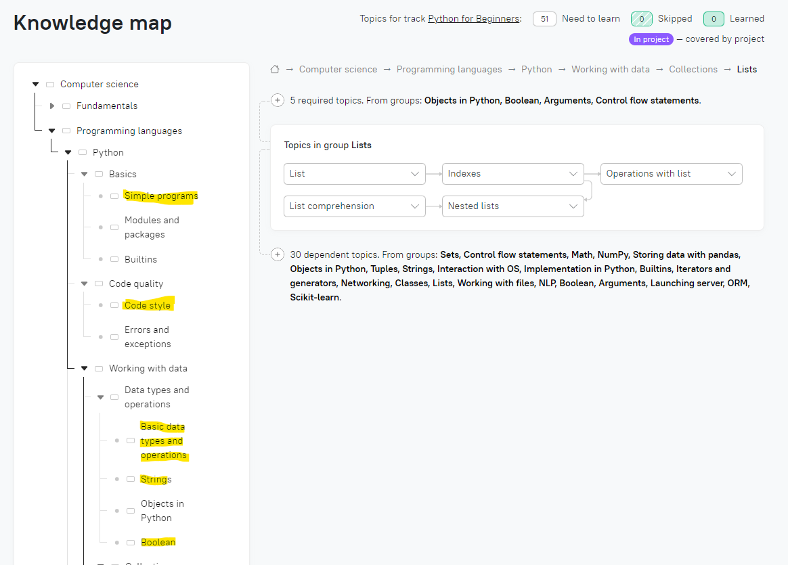

## Бали, терміни здачі та екзамен

### Максимальний бал

За підсумками терму, максимальна кількість балів буде наступною:
1. Дві практичні роботи по 5 балів максимум, одна - 6 балів
2. Два домашніх завдання у муддлі по матеріалам лекцій (друга лекція відбудеться у чт, 21 жовтня) по 4 бали
3. Midterm exam - 6 балів
4. Final exam - 8 балів

Сумарно: **38** балів. Проте, для заохочення тих студентів, хто старався та виконував завдання повністю, будуть наступні зміни:
1. Третя робота буде оцінюватись не від 3 балів за перший рівень до 5 за останній, а від 4 до 6.
2. Максимальний бал за кожну роботу буде розраховуватись із огляду здачі робіт на "середній" рівень складності. Тобто, максимум за курс розраховується на рівні **35 балів**, а кожна робота, здана вами на 5 - це один додатковий бал до вашого результату.
Крім того, на третю роботу не буде дедлайну - її можна буде здавати на практичних дл 25 жовтня.

Якщо 35 балів - це 100%, то для переведення набраних студентом балів у стобальну шкалу буде застосовуватись коефіцієнт **2.86**. Детальний опис балів:

Таким чином, для успішного проходження курсу, необхідно набрати **21 бал з 35**

### Як буде проходити езкамен?

Студенти, хто перед екзменом буде мати **15 та більше** балів, підуть на звичайний екзамен, який буде проходити у такому само форматі як і мідтерм, тільки на всю пару. Максимальний бал - 8

Студенти, у кого буде **від 6 до 15 балів**, в якості виключення, яке надається через те що це тільки перший терм вашого навчання змоужть написати окремий екзамен "на задовільно", з простішими задваннями. Успішне складання цього екзамену дозволить отримати оцінку "задовільно"

Студенти, у кого буде **менше 6 балів** до екзаменів не допускаються

### Які теми необхідно знати на екзамені?

1. Поняття змінної, створення та використання. Область видимості (scope)
2. Поняття типу даних.
3. Читання з консолі та виведення інформації на екран.
4. Коментарі
5. Типи даних: `integer`. Операції, що підтримуються (базова арифметика, піднесення до степеню, ділення націло та остача).
6. Типи даних: `bool`. Операції над ним: `and`, `not` та `or`
7. Тип даних: `string`. Робота з рядками, методи `slice()` та `index()`, знаходження підрядків (синтаксис `row[a:b:c]`). Форматування рядків.
8. Конструкція `if`
9. Цикл `while`, цикл `for`.
10. Перетворення значень між різними типами даних (напр., рядок "3" у число 3 та навпаки)
11. Функції - створення, використання.
12. Глобальні змінні, доступ до них та модифицікація
13. Списки - створення, додавання та видалення елементів.
14. Ітерування по списку або рядку за допомогою конструкції `for ... in ...`
15. Файли - відкривання файлів для читання, зчитування рядків, запис рядків у файл.
16. Словник - створення, додавання елементів, доступ до елементів
17. Доступ до аргументів командного рядка

### Як готуватись до езкамену?

Нижче в документі є перелік завдань для самопідготовки. Пробуйте розв'язувати їх одна зо одною (або пропускайте, якщо на 100% впевнені як це зробити). 

Якщо на певному етапі ви відчуваєте складність - в першу чергу я рекомендую повернутись до сайту де ми виконували першу практичну - [JetBrains Academy](https://hyperskill.org/knowledge-map/1206), та ще раз уважно пройти теми з курсу Python for Beginners: Computer Science > Programming Languages > Python > Basics [Simple programm]; Code quality [Code style]; Basic data types and operations; Strings; Boolean; Collections > Lists; Control flow > functions; control flow statements. Не забувайте у кожному розділі повністю проходити розділ practice!

Крім того, на мудлі є книжки Python Crash Course, перші 6 розділів якої повторюють наші теми, детально проходячи по кожній. 

Також не забувайте про практичні роботи, консультації, та телеграм - лектор та асистенти завжди готові допомогти вам

### Як добрати балів?

1. Уважно підійдіть до лекції в четвер - за тест на мудлі можна буде отримати до 4 балів
2. Здавайте у пн другу практичну, а до 25.10 - третю. На лекції ми детально розглядали як відкрити файл та пройтись по його змісту. Це дасть вам ще до 6 балів
3. Якщо ви претендуєте на екзамен "на задовільно", принесіть та покажіть всі виконані наведені нижче завдання для самопідготовки - ви отримаєте за це 3 бали. Увага - завдання мають бути виконані самостійно - це легко перевірити, будь-який плагіат буде каратись дискваліфікацією. Якщо у вас виникають складнощі з якимось завданням - приходтье, питайте

### Приклади завдань для самопідготовки

1. Зчитайте з консолі число та виведіть на екран це число, помножене на 2
2. Зчитайте з консолі число, якщо воно непарне - виведіть "The number is odd", інакше - "The number is even"!
3. Зчитайте з консолі рядок, та виведіть на екран підрядок з 3 до 8 символ ("Hello, world" -> "llo, ")
4. Зчитайте з консолі речення, та виведіть на екран перше слово цього речення
5. Створіть функцію, що приймає декілька змінних типу bool та повертає True, якщо всі вони дорівнюють True
6. Зчитайте з консолі число N, та виведіть на екран послідовно квадрати всіх чисел від 1 до N
7. Створіть функцію, що приймає на вхід два числа та повертає True, якщо вони однакової парності, або False, якщо ні
8. Створіть функцію, що приймає список чисел, та повертає список з кубів цих чисел
9. Прочитайте з консолі номер дня у році та вивдіть номер тижня, в якому знаходиться цей день
10. Створіть функцію, що приймає список чисел, та виводить на екран всі числа, більші за 100 у цьому списку
11. Відкрийте файл, прочитайте його зміст, зчитайте з консолі та запишіть у інший файл
12. Виведіть на екран всі аргументи комнадного рядка, з якими була запущена програма
13. Створіть функцію, що приймає список чисел та повертає рядок, що містить всі ці числа без роздільника ([1, 2, 33, 4] -> "12334")
14. Створіть функцію, що приймає рядок та літеру, та повертає кількість цих літер в рядку
15. Зчитайте рядок з консолі, та виведіть на екран рядок, що складається з кожного другого символа цього рядку

### Складніші завдання
1. Напишіть програму, що запитує у користувача шлях до текстового файлу та виводить його статистику: а) кількість символів (пробіли, крапки та коми не рахуються), б) кількість слів, в) слово, що найчастіше зустрічається
2.  Напишіть програму для складання дат: користувач має ввести день у форматі `"[day] of [month]"` (Наприклад, `10 of May`) та проміжок у форматі `[x] days`, програма має вивести день, який настане через цей проміжок. Для спрощення можна вважати що у кожному місяці 30 днів
3. Напишіть функцію, що приймає три аргументи: два словника - перший - ім'я -> зарплата (наприклад, `{"John":1500, "Rebecca":2500, "Bob":3000}`), другий - ім'я -> посада (наприклад, `{"John":"Intern", "Rebecca":"Engineer", "Bob":"Engineer"}`), а також рядок-посаду. Функція має повернути середній оклад всіх фахівців на цій посаді, або None, якщо на цій посаді ніхто не працює. У данному прикладі: Engineer -> 2750, Intern -> 1500, CEO -> None
4. Не підглядаючи у приклад з лекції, спробуйте самостійно написати програму-гру про вгадування числа. Програма має загадати число від 1 до N, та дати гравцю M спроб відгадати його, але вказуючи при кожній невдалій спробі чи введене число більше чи менше загаданого. Числа N та M зчитайте з аргументів командного рядка
